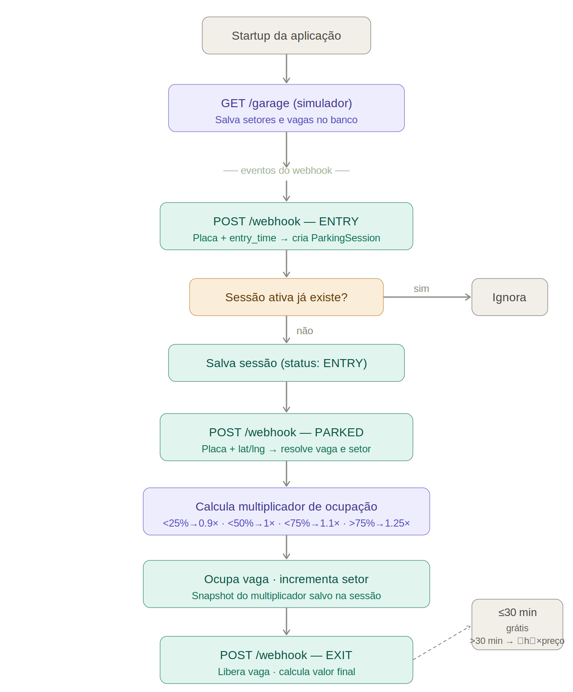

# Parking Manager

Backend application responsible for processing parking events in real time, managing parking spots occupancy and calculating parking revenue dynamically based on sector occupancy rate.

The project was built using Java 21 and Spring Boot following Clean Architecture principles and focusing on transactional consistency, testability and maintainability.



## Tech Stack

- Java 21
- Spring Boot
- Spring Data JPA
- Spring Cloud OpenFeign
- MapStruct
- Lombok
- MySQL
- H2 Database
- Docker
- Gradle
- JUnit 5
- Mockito
- Flyway

## Architecture

The application was structured using simplified [Clean Architecture](https://medium.com/@gabrielfernandeslemos/clean-architecture-uma-abordagem-baseada-em-princ%C3%ADpios-bf9866da1f9c).

Layers:

- Domain
    - Core business rules and entities
- Application
    - Use cases and orchestration
- Infrastructure
    - Database, HTTP clients and external integrations
- API
    - Controllers and request/response mapping

## Business Rules

### General Rules

- A parking spot becomes occupied only after a PARKED event.
- The first 30 minutes are free.
- After 30 minutes, the full hour price is charged.
- Parking price varies according to sector occupancy.
- A sector cannot exceed its maximum capacity.
- EXIT events release both spot and sector occupancy.

### Pricing Logic

Occupancy multiplier is dynamically calculated based on sector occupancy rate.

| Occupancy Rate | Multiplier |
|---|---|
| < 25% | 0.90 |
| <= 50% | 1.00 |
| <= 75% | 1.10 |
| > 75% | 1.25 |

## Running the Project

### Requirements

- Java 21
- Docker
- Docker Compose

### Running

Linux/macOS:

```bash
docker compose down -v && docker compose up --build
```

Windows PowerShell:

```bash
docker compose down -v; docker compose up --build
```

### Explanation

When running the `docker-compose` command, all project dependencies will start automatically, including:

- MySQL database
- Garage simulator
- Parking Manager application

During startup, the application consumes the `/garage` endpoint provided by the simulator in order to create the parking sectors and spots locally.

After the initialization process, the application starts listening for parking events through the `/webhook` endpoint, processing vehicle entry and exit events in real time.

### Important Notes

#### Recreate Database

The application uses Docker volumes to persist the MySQL database data.

To ensure the garage simulation always starts with a clean state and avoids leftover data from previous executions, it is recommended to remove the containers and volumes before running the project again:

```bash
docker compose down -v
```

This removes the persisted database volume, allowing Flyway migrations and the garage initialization flow to start from an empty state.

#### Simulator Behavior

During the garage simulation, it was noticed that most `EXIT` events happen in less than 30 minutes after the vehicle entry.

Because of the pricing rule implemented, these sessions result in a final amount of `0`.

To make revenue testing easier and faster during local executions, the free parking validation rule can be temporarily commented out.

However, even with this change, the difference between `entry_time` and `exit_time` still needs to be greater than 1 minute. Otherwise, the calculated amount may still result in `0` due to time rounding/charge calculation behavior.

## API Endpoints

### Parking Webhook

POST `/webhook`

Processes parking events sent by simulator.

### Revenue

GET `/revenue`

Returns sector revenue for a given day.

## Tests

### Explanation

The project contains:

- Unit tests for:
    - Domain entities
    - Services
    - Use cases

- Integration tests for:
    - Controllers
    - Repositories
    - Transactional flows

### Running

```bash
./gradlew clean test
```

## Design Explanations

### Architecture Decisions

A simplified Clean Architecture approach was used to balance organization and pragmatism for the scope of this challenge.

JPA and domain entities were intentionally unified to avoid unnecessary mapping complexity and excessive boilerplate.

The project still preserves clear separation of responsibilities between domain, application and infrastructure layers.

### Idempotency

Garage initialization avoids duplicated data during repeated executions.

Parking events are also validated by entity status before processing, helping prevent duplicated event handling and invalid state transitions.

### Concurrency and Consistency

Pessimistic locking was applied at the spot level only. For sectors, locking was avoided due to high contention — every parking event hits the same sector rows.

Consistency is instead enforced through database CHECK constraints, preventing invalid states at the database level.

### Scalability

The application was designed with clear separation of responsibilities and stateless behavior, allowing horizontal scaling of application instances if necessary.

### Revenue Endpoint and Calculation

The `/revenue` endpoint accepts parameters as a JSON request body following the challenge spec. In production, query params would be preferred for better compatibility with proxies and HTTP caches.

Revenue is calculated dynamically from parking session data instead of maintaining aggregated counters, reducing synchronization complexity and avoiding inconsistent financial data.